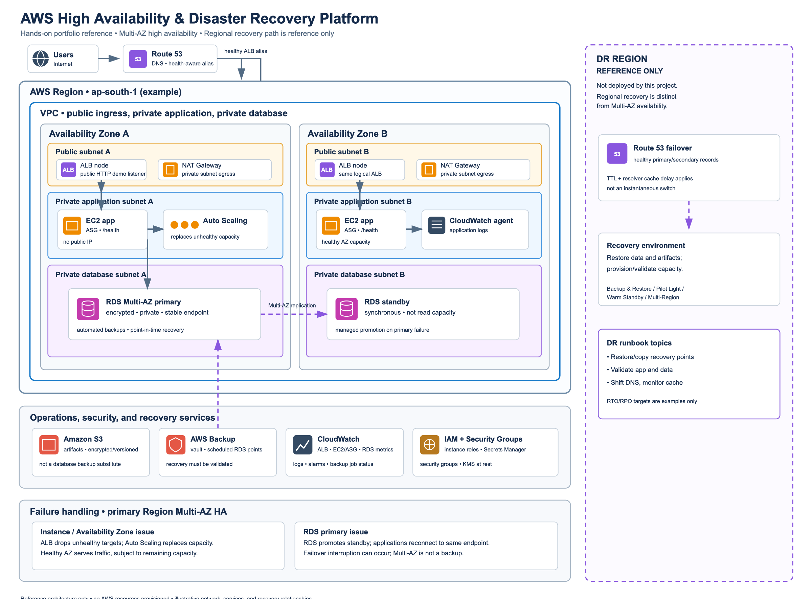

# AWS HA/DR reference architecture

This diagram describes the **hands-on portfolio reference design**. It does not represent a deployed AWS environment. Multi-AZ within the primary Region is the HA design. The dashed DR target is a recovery option for discussion and is not provisioned by this repository.

The Application Load Balancer is one logical resource enabled across public subnets in both Availability Zones. It forwards to an EC2 Auto Scaling group in private application subnets. A Multi-AZ RDS DB instance has a primary and synchronous standby in separate private DB subnets and uses one database endpoint; the standby is for failover, not read scaling. S3 in this project is for artifacts and recovery material, not a replacement for database backups.
